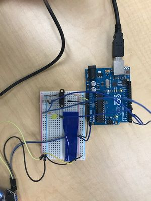

# Intermediate_Arduino
My Intermediate_Arduino assignments

Hello LCD was an assignment created to make an LCD print "Hello World". In this assignment I learned how to wire an LCD and I began to learn how to code one. This assignment was a bit challenging for me, but I feel like I got a lot out of it. Next time I would get more help on the assignment sooner, so that I am able to complete the assignments faster.

LCD Backpack was an assignment that made an LCD screen light up and say "button presses= (however many times the button has been pressed)". In this assignment, I learned how to wire an LCD Backpack. This assignment was a slight challenge for me because it had been a while since the last time I wired anything. I would spend my time wisely next time so that I can complete the assignments faster. 

 

The Photointerrupter was an assignment that created a circuit that turned on an LED when a piece of paper went in between the legs of it. In this assignment I learned how to use a photointerrupter. This assignment was pretty easy and simple for me. Next time I would get help on my code so that I can move onto the next assignment faster.

 

LED Blink Revisited was an assignment created to re-introduce LED's and Arduinos. I didn't learn anything in this assignment because I was taught how to wire an LED to an Arduino last year. This assignment was reallyy easy for me. I would not do anything different next time. 

 

Motor Control was an assignment created to learn how to wire a motor and code the arduino to make the motor move the way we want it to. This assignment was difficult because I have never used a motor before and I didn't know how to wire or code it. It took me a while to complete this assignment. Next time I would look up instructions so that I am able to do a better job on this assignment. 

 
